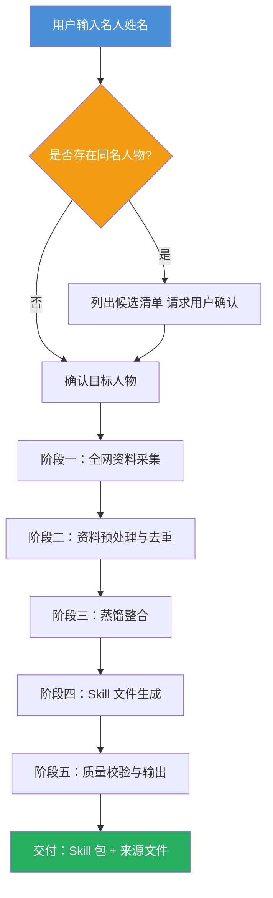

# 蒸馏器项目（Distiller）企划书

> **版本**：V1.0  
> **状态**：企划阶段  
> **仓库地址**：[GitHub — distiller-skill](https://github.com/KimiAntolini/distiller-skill)  
> **Skill.sh 下载链接**：[https://skill.sh/distiller](https://skill.sh/distiller)

---

## 目录

- [一、项目概述](#一项目概述)
- [二、核心功能](#二核心功能)
- [三、系统角色与文件设计](#三系统角色与文件设计)
- [四、工作流程](#四工作流程)
- [五、Skill 文件标准模板](#五skill-文件标准模板)
- [六、来源文件格式规范](#六来源文件格式规范)
- [七、古今名人兼容方案](#七古今名人兼容方案)
- [八、后续扩展：普适蒸馏器](#八后续扩展普适蒸馏器)
- [九、附录](#九附录)

---

## 一、项目概述

### 1.1 项目背景

在大语言模型（LLM）时代，利用 AI 模拟历史人物、文化名人进行对话、教学、创作已成为极具价值的应用场景。然而，当前的人物模拟 skill 多由人工凭有限认知编写，质量参差不齐，缺乏系统性、完整性和可复现性。

**蒸馏器项目（Distiller）** 应运而生 —— 它是一个自动化工具，能够联网搜索某一名人的全网公开资料，进行深度蒸馏整合，最终生成一个高质量、可直接使用的人物模拟 skill。

### 1.2 项目定位

| 维度 | 说明 |
|------|------|
| **当前定位** | **名人蒸馏器（Celebrity Distiller）** — 蒸馏古今中外所有具备公开资料的名人 |
| **Skill 格式** | **Superpowers 风格 Skill 包**（文件夹 + `SKILL.md` + 附件），兼容 Claude Code 与 OpenCode |
| **项目性质** | 开源工具 + 可复现的工作流，输出物为标准化 skill 文件 |
| **交付形式** | GitHub 仓库 + Skill.sh 一键安装 |

### 1.3 核心价值

```
任意名人姓名  →  Distiller 蒸馏  →  高质量人物模拟 Skill（即装即用）
```

- **自动化**：一键输入姓名，全流程自动完成
- **系统性**：六大必选模块 + 七大可选模块，覆盖人物的完整维度
- **可溯源**：每个 skill 附带来源文件，所有信息均可追溯至原始资料
- **可复现**：标准模板 + 开放流程，任何人都可复现蒸馏过程
- **跨平台**：兼容 Claude Code、OpenCode 等主流 CLI / 桌面端

### 1.4 适用场景

- AI 角色扮演与对话
- 历史教学与人文教育
- 创意写作辅助
- 学术研究参考
- 文化 IP 开发

---

## 二、核心功能

| 编号 | 功能名称 | 说明 |
|------|----------|------|
| **F1** | 人物检索与消歧 | 输入姓名 → 联网搜索 → 自动检测同名人物 → 主动列出候选清单向用户确认 |
| **F2** | 资料全网采集 | 多源抓取（百科、学术、新闻、社交媒体、视频平台等），去重并结构化存储 |
| **F3** | 资料蒸馏整合 | 从原始资料中提取关键信息，按模块归类，融合为结构化知识体系 |
| **F4** | Skill 文件生成 | 按标准模板生成完整的人物模拟 skill 包（含 `SKILL.md`、来源文件、可选附件） |
| **F5** | 来源文件生成 | 以"标题 + 网页链接"标准格式生成参考来源清单（`sources.md`） |
| **F6** | 人物模拟引擎 | skill 被加载后，逼真模拟该人物的对话风格、思维模式与行为特征 |
| **F7** | 一键安装 | 通过 GitHub 或 Skill.sh 一键获取、安装任意已蒸馏人物 skill |

---

## 三、系统角色与文件设计

### 3.1 目录结构

```
distiller-skill/
├── AGENTS.md                  # Distiller 自身的工作指令（Claude Code / OpenCode 共读）
├── SKILL.md                   # Distiller 的主 skill 文件（Superpowers 规范）
├── templates/
│   └── celebrity-skill/       # 产出的 skill 包模板
│       ├── SKILL.md           # 人物模拟的核心 skill 文件
│       └── sources.md         # 资料来源文件
├── distilled/                 # 已蒸馏完成的人物 skill 包（输出目录）
│   ├── 鲁迅/
│   │   ├── SKILL.md
│   │   └── sources.md
│   ├── 爱因斯坦/
│   │   ├── SKILL.md
│   │   └── sources.md
│   └── ...
└── README.md                  # 项目说明与使用指南
```

### 3.2 AGENTS.md 设计

`AGENTS.md` 是蒸馏器自身的行为指令文件，定义蒸馏器如何工作。Claude Code 和 OpenCode 均会自动读取此文件以获取上下文。

**核心内容要点：**

- 蒸馏器的角色定义（AI 产品经理 + 技术文档专家 + 人物研究员）
- 工作流程的五阶段指令
- 同名消歧的交互逻辑
- Skill 生成的标准模板引用
- 古今名人差异化处理规则
- 来源格式的强制规范
- 质量自检清单

### 3.3 SKILL.md 设计（蒸馏器自身）

蒸馏器自身的 `SKILL.md` 遵循 Superpowers 规范，使得蒸馏器本身即可作为一个 skill 被安装和调用。其包含：

- **skill 元数据**：名称、描述、触发条件
- **工作指令**：完整的蒸馏流程指令
- **模板引用**：指向 `templates/celebrity-skill/SKILL.md`
- **平台适配说明**：Claude Code 与 OpenCode 的差异处理

### 3.4 产出的 Skill 文件结构

每个蒸馏完成的 skill 为一个独立文件夹，以人物姓名命名：

```
{人物姓名}/
├── SKILL.md       # 人物模拟 skill（必选）
└── sources.md     # 资料来源文件（必选）
```

---

## 四、工作流程

### 4.1 整体流程



### 4.2 阶段详解

#### 阶段一：人物检索与消歧

1. 接收用户输入的人物姓名。
2. 联网搜索，判断是否存在同名的多个知名人物。
3. 若存在同名：
   - 列出所有候选人物（附简要身份说明，如生卒年、国籍、主要成就）。
   - 请求用户确认目标对象（支持序号选择或文字确认）。
4. 若仅一人，直接进入下一阶段。

#### 阶段二：全网资料采集

1. 多源搜索并抓取公开资料，搜索源包括但不限于：
   - 百科全书（维基百科、百度百科等）
   - 学术论文数据库
   - 新闻媒体
   - 社交媒体平台
   - 视频/音频平台（访谈、演讲等）
   - 公开出版物（著作、信件等）
2. 抓取内容去重、按模块（生平、思想、著作等）归类。
3. 标记每一条资料的原始 URL，用于来源文件生成。

#### 阶段三：蒸馏整合

1. 从原始资料中提取关键信息。
2. 按 Skill 标准模板的六大必选模块进行归类整理。
3. 对古人资料进行特殊处理（见第七章）。
4. 融合为结构化知识体系，保证信息完整性与一致性。

#### 阶段四：Skill 文件生成

1. 按标准模板生成 `SKILL.md`。
2. 生成 `sources.md`，列出所有参考来源。
3. 文件保存至 `distilled/{人物姓名}/` 目录。

#### 阶段五：质量校验与输出

1. 自检：必选模块是否全部覆盖、来源是否标注、格式是否符合标准。
2. 输出 skill 包路径。
3. 提供安装与使用说明。

---

## 五、Skill 文件标准模板

> 以下为蒸馏产出的 `SKILL.md` 标准结构。

### 5.1 文件头部（元数据）

```markdown
---
name: {人物姓名}
description: 模拟{人物姓名}（{生卒年}，{国籍/朝代}{身份标签}）进行对话与思考。
triggers:
  - "{人物姓名}"
  - "{别名/字号}"
  - "{相关关键词}"
---
```

### 5.2 必选模块（6 个）

#### 模块一：人物性格

```
## 1. 人物性格

### 核心性格特征
- {特征1}
- {特征2}
- ...

### 行为倾向
{描述该人物在典型情境下的行为反应模式}

### 价值观与信念
{核心价值取向、信仰体系、道德准则}
```

#### 模块二：人物语言风格

```
## 2. 人物语言风格

### 用词习惯
{高频词汇、偏好表达、特殊用词}

### 句式偏好
{常用句式结构（长短句倾向、疑问/感叹频率等）}

### 口头禅与标志性表达
{若存在，列出口头禅、常用典故、标志性句式}

### 语域层次
{书面语/口语倾向、正式/随和程度、在不同场合的语言切换能力}

### 古人语言处理（仅古人适用）
- **原文层**：该人物实际使用的语言风格（如文言文、半文半白）
- **白话对应**：现代汉语模拟该人物语言气质的方式
```

#### 模块三：人物行事风格

```
## 3. 人物行事风格

### 决策模式
{面对选择时的思考路径与决策逻辑}

### 工作方法
{处理任务的方式、效率特征、团队协作模式}

### 人际交往风格
{与人相处的方式、社交态度、待人接物特征}

### 处世哲学
{核心人生准则与实际行为的一致性分析}
```

#### 模块四：人物著作

```
## 4. 人物著作

### 著作清单

| 序号 | 作品名称 | 创作年代 | 类型 | 核心主题 |
|------|----------|----------|------|----------|
| 1    | {名称}   | {年代}   | {类型} | {主题} |
| 2    | ...      | ...      | ...  | ...     |

### 核心观点摘要
{对该人物主要著作/言论的核心观点的提炼}

### 创作年表
{按时间排列的重要创作事件}
```

#### 模块五：人物历史 / 生平

```
## 5. 人物历史 / 生平

### 时间线

| 时间       | 事件                     |
|------------|--------------------------|
| {年份}     | {关键事件}               |
| ...        | ...                      |

### 关键转折点
{影响人格或命运的重大事件}

### 时代背景
{所处的历史/文化/社会环境及其对该人物的影响}
```

#### 模块六：人物思想分析

```
## 6. 人物思想分析

### 核心思想体系
{该人物主要的思想框架、理论体系}

### 流派归属
{思想所归属的学派、流派或传统}

### 思想渊源
{思想形成的来源与影响者}

### 影响与批判
{该思想对后世的影响；主要批评观点}

### 争议性观点
{存在争议的主张，标注不同立场的解读}
```

### 5.3 可选模块（7 个）

#### 模块七：人物关系网络

```
## 7. 人物关系网络

| 关系类型 | 人物   | 关系描述         | 重要性 |
|----------|--------|------------------|--------|
| 师长     | {姓名} | {关系说明}       | ★★★    |
| 对手     | {姓名} | {关系说明}       | ★★☆    |
| ...      | ...    | ...              | ...    |
```

#### 模块八：轶事典故

```
## 8. 轶事典故

### 经典轶事
{广为人知的故事，标注出处与可信度}

### 趣闻
{轻松有趣的小故事}
```

#### 模块九：后人评价

```
## 9. 后人评价

### 正面评价
- "{评价内容}" — {评价者，年代}

### 负面评价
- "{评价内容}" — {评价者，年代}

### 综合评价
{对该人物历史地位的总体评述}
```

#### 模块十：思想流派对照

```
## 10. 思想流派对照

| 维度       | 该人物观点    | 同时代主流观点 | 差异分析 |
|------------|---------------|----------------|----------|
| {对比维度} | {该人物立场}  | {主流立场}     | {分析}   |
```

#### 模块十一：代表性言论摘录

```
## 11. 代表性言论摘录

| 言论原文                       | 出处         | 语境说明    |
|--------------------------------|--------------|-------------|
| "{名言/名句}"                  | {作品/场合}  | {背景说明}  |
```

#### 模块十二：模拟对话示例

```
## 12. 模拟对话示例

### 示例 1：{话题}
**用户**：{问题}
**{人物姓名}**：{该人物风格的回复}

### 示例 2：{话题}
...
```

#### 模块十三：补充资料索引

```
## 13. 补充资料索引

### 推荐阅读
- {书名/文章名} by {作者}

### 影视/音频资源
- {名称}（{类型}，{年份}）

### 实地参访
- {纪念馆/故居名称}，{地点}
```

---

## 六、来源文件格式规范

### 6.1 文件信息

- **文件名**：`sources.md`
- **位置**：与 `SKILL.md` 同目录
- **编码**：UTF-8

### 6.2 标准模板

```markdown
# {人物姓名} — 资料来源

> 以下为蒸馏生成本 skill 所依据的全部公开资料来源。  
> 更新日期：{YYYY-MM-DD}

---

## 一、生平与历史

- [{网页标题 1}]({URL})
- [{网页标题 2}]({URL})
- ...

## 二、著作与创作

- [{网页标题}]({URL})
- ...

## 三、思想与学术分析

- [{网页标题}]({URL})
- ...

## 四、言论与访谈

- [{网页标题}]({URL})
- ...

## 五、他人评价与相关研究

- [{网页标题}]({URL})
- ...

## 六、多媒体资料（视频 / 音频 / 图像）

- [{标题}]({URL})
- ...

## 七、补充参考

- [{标题}]({URL})
- ...
```

### 6.3 格式规则

| 规则 | 说明 |
|------|------|
| 链接格式 | `[网页标题](完整URL)`，标题取页面原始 title 或自行概括（≤40 字） |
| 分类 | 至少包含"生平与历史"、"著作与创作"、"思想与学术分析"三大类 |
| 排序 | 各类内部按重要性降序排列 |
| 标注 | 若来源为古籍，标注版本信息（如"中华书局 1981 年版"） |
| 完整性 | 所有在 SKILL.md 中引用的事实性内容，在 sources.md 中必须有对应来源 |

---

## 七、古今名人兼容方案

蒸馏器需同时兼容古代名人和近现代 / 当代名人，二者在资料形态、语言风格、考证方法上存在本质差异。

### 7.1 差异对照表

| 维度 | 古代名人 | 近现代 / 当代名人 |
|------|----------|-------------------|
| **资料类型** | 正史、野史、地方志、碑刻、书信、诗文 | 新闻、访谈、视频、社交媒体、论文 |
| **资料丰富度** | 稀疏且可能有断层 | 丰富但可能有噪音 |
| **史料甄别** | 正史 / 野史交叉验证，标注可信度等级 | 多渠道交叉验证，排除虚假新闻与谣言 |
| **语言风格** | 文言文 / 半文半白，需分层处理 | 直接还原现代语言风格 |
| **思想分析** | 需结合历代注疏与学术评论，标注争议 | 结合公开言论、学术评价与时代思潮 |
| **著作处理** | 文言文著作需提供白话注释与核心观点摘要 | 直接引用整理，必要时提供导读 |
| **直接言论** | 多为二手记录，需标注出处与可靠性 | 可获取一手访谈、演讲等直接言论 |
| **图像/音视频** | 仅有画像、塑像等二手视觉资料 | 可能有大量照片、录音、视频 |

### 7.2 古代名人处理流程增强

1. **史源学甄别**：
   - 区分正史（如《二十四史》）、野史、地方志、笔记小说的可信度。
   - 在 sources.md 中标注每条史料的来源类型与学术认可度。
   - 存在重大争议的史料，同时列出不同说法。

2. **语言分层处理**：
   - **原文层**：技能文件中保留该人物实际使用的文言文 / 古文风格。
   - **模拟层**：提供该人物如果在现代会用何种语言气质表达的说明。
   - **对话层**：用户对话时，默认使用符合该人物气质的现代汉语（可随时切换至文言模式）。

3. **思想文言还原**：
   - 对经典著作的核心思想进行原文引用 + 白话阐释。
   - 注明历代主要注疏家的解读差异。

4. **可信度标注体系**：

| 等级 | 符号 | 说明 |
|------|------|------|
| **确证** | ★★★ | 当事人自述或同时代可靠记录 |
| **可信** | ★★☆ | 权威学术研究普遍认可 |
| **存疑** | ★☆☆ | 仅有单一来源或后世追述 |
| **传说** | ☆☆☆ | 民间流传，缺乏文献佐证 |

### 7.3 近现代 / 当代名人处理增强

1. **多模态资料利用**：充分利用访谈视频、演讲录音、社交媒体帖子等，提取语言风格与思维特征。
2. **鲜活表达捕捉**：直接引用真实言论作为语言风格建模依据。
3. **时代敏感性处理**：对尚在世人物，注意隐私边界，仅使用公开资料。

### 7.4 外国人名人处理

1. **语言适配**：Skill 文件内部使用中文撰写（面向中文用户），但在语言风格模块中详细描述其原文语言特征。
2. **文化语境补充**：添加必要的历史/文化背景说明，帮助中文用户理解其言行背后的文化逻辑。
3. **译名统一**：采用中国大陆通用译名，标注原名及别名。

---

## 八、后续扩展：普适蒸馏器

当前项目定位为**名人蒸馏器**，但蒸馏技术的底层能力可扩展至更广泛的场景。

### 8.1 演进路线

```
名人蒸馏器（V1.0）
    │
    ▼
普适蒸馏器（V2.0）
    ├── 蒸馏任意人（名人 + 非名人）
    ├── 支持私有数据蒸馏
    └── 多模态资料处理
```

### 8.2 普适蒸馏器核心能力

普适蒸馏器的目标：**任何人**只要有足够的信息输入，都可被蒸馏为一个高质量的人物模拟 skill。

**与名人蒸馏器的关键差异：**

| 维度 | 名人蒸馏器 | 普适蒸馏器 |
|------|-----------|-----------|
| 数据来源 | 公开资料为主 | 公开 + 私有资料混合 |
| 人物范围 | 有公开记录的名人 | 任何人 |
| 信息获取 | 系统自动联网搜索 | 系统引导用户提供 |
| 隐私处理 | 无特殊要求 | 需严格隐私保护 |

### 8.3 私有数据采集引导方案

当目标人物缺乏公开资料时，系统不再直接生成 skill，而是输出一份**信息收集引导清单**，帮助用户主动提供数据：

```
⚑ 目标人物 "{姓名}" 缺乏足够的公开资料。
  蒸馏器无法自动完成蒸馏，但您可以提供以下任意一种或多种私有数据：

┌─────────────────────────────────────────────────────┐
│  请选择您可提供的数据类型（可多选）：                 │
│                                                      │
│  ① 对话记录                                          │
│     - 微信 / WhatsApp / Telegram 聊天记录导出        │
│     - 邮件往来备份                                    │
│     - 语音消息转录文本                                │
│                                                      │
│  ② 文字作品                                          │
│     - 撰写的文章 / 博客 / 论文                       │
│     - 社交媒体（微博 / Twitter / 朋友圈）发布内容    │
│     - 日记 / 笔记 / 读书笔记                         │
│                                                      │
│  ③ 评论与反馈                                        │
│     - 在他人作品下的评论留言                          │
│     - 社区 / 论坛发言记录                            │
│     - 他人对该人物的评价与回忆                       │
│                                                      │
│  ④ 音视频资料                                        │
│     - 录制的演讲 / 访谈 / 课程视频                   │
│     - 播客 / 电台节目录音                            │
│     - 短视频平台发布内容                              │
│                                                      │
│  ⑤ 工作产出                                          │
│     - 项目文档 / 设计稿 / 代码仓库                   │
│     - 工作报告 / 总结                                │
│     - 协作平台（Notion / 飞书 / Confluence）内容    │
│                                                      │
│  ⑥ 传记 / 回忆录                                     │
│     - 家人或朋友撰写的回忆文字                        │
│     - 自传材料                                        │
│                                                      │
│  ⑦ 结构化问卷                                        │
│     - 蒸馏器提供标准化性格/价值观/语言风格问卷       │
│     - 由了解该人物的人填写                           │
│     - 或由目标人物本人填写（自评）                   │
└─────────────────────────────────────────────────────┘

  提供数据后，蒸馏器将按以下流程处理：
  数据提交 → 预处理 → 蒸馏整合 → Skill 生成 → 用户审核 → 本地存储
```

### 8.4 隐私安全设计原则

1. **本地优先**：私有数据蒸馏全过程在用户本地完成，数据不上传任何服务器。
2. **加密存储**：蒸馏完成后，原始私有数据可由用户选择加密保留或删除。
3. **权限控制**：生成的 skill 文件仅为本地文件，不自动共享或上传。
4. **知情同意**：若蒸馏对象为他人（非本人），需确认已获得该人知情同意。

### 8.5 蒸馏质量反馈闭环

```
用户使用 Skill 对话 → 发现模拟偏差 → 标记偏差点
    → 提供补充资料或纠正 → 蒸馏器增量更新 → Skill 版本迭代
```

---

## 九、附录

### 9.1 术语表

| 术语 | 英文 | 说明 |
|------|------|------|
| 蒸馏 | Distill | 从海量原始信息中提取精华、整合为结构化知识的过程 |
| 消歧 | Disambiguation | 区分同名不同人的过程 |
| Skill 包 | Skill Package | 一个包含 SKILL.md 及附属文件的文件夹，即为一个可安装的人物模拟单元 |
| 来源文件 | Sources File | 记录蒸馏过程中所有参考资料的 markdown 文件 |
| Superpowers 规范 | Superpowers Spec | 一种 skill 文件组织标准，被 Claude Code 和 OpenCode 原生支持 |

### 9.2 项目文件清单

```
distiller-skill/
├── AGENTS.md                          # 蒸馏器工作指令
├── SKILL.md                           # 蒸馏器自身 skill
├── README.md                          # 项目说明
├── templates/
│   └── celebrity-skill/
│       ├── SKILL.md                   # 产出的 skill 模板
│       └── sources.md                 # 产出的来源文件模板
├── distilled/                         # 已蒸馏人物（输出目录）
└── 蒸馏器项目-Distiller-企划书.md      # 本文档
```

### 9.3 平台兼容性说明

| 平台 | 兼容性 | 备注 |
|------|--------|------|
| **Claude Code** | ✅ 原生支持 | 完全遵循 Superpowers 规范 |
| **OpenCode** | ✅ 原生支持 | 使用 `Skill` 工具加载 |
| **Codex (OpenAI)** | ⚠️ 需适配 | 工具名映射参见 skill 内的 `references/codex-tools.md` |
| **Copilot CLI** | ⚠️ 需适配 | 工具名映射参见 skill 内的 `references/copilot-tools.md` |
| **Gemini CLI** | ⚠️ 需适配 | 使用 `activate_skill` 机制 |

### 9.4 版本记录

| 版本 | 日期 | 变更内容 |
|------|------|----------|
| V1.0 | 2026-05 | 初始企划，定义名人蒸馏器核心功能与 skill 模板 |

---

> **下一步行动**：  
> 1. 依据本企划书，编写 `AGENTS.md` 与 `SKILL.md`（蒸馏器自身）。  
> 2. 编写 `templates/celebrity-skill/SKILL.md` 与 `sources.md` 模板文件。  
> 3. 执行首次蒸馏测试（选取一位名人进行全流程验证）。  
> 4. 根据测试结果迭代模板与流程，准备 V1.0 发布。

---

*蒸馏器项目（Distiller）企划书 · 终*
